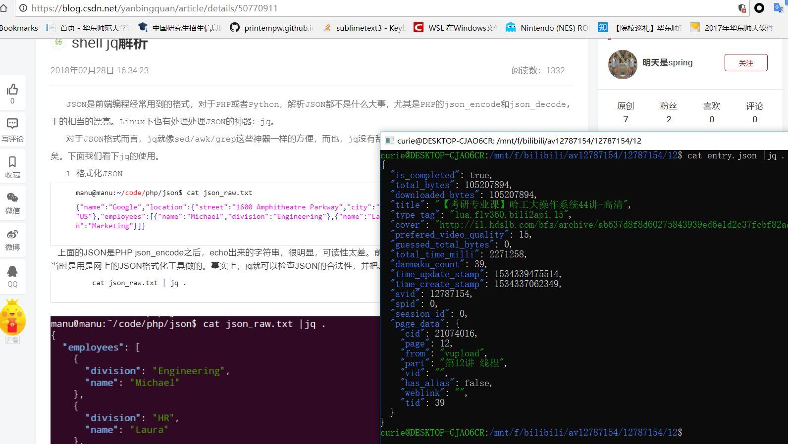

## bilibili_mp4_fucker

------------------

更新：

 新增弹幕danmaku.xml导出功能，danmaku.xml将被命名为与mp4同名的弹幕xml文件。
 将合并后的视频和 同名danmaku.xml 弹幕文件一起拖入「BiliLocal」等本地弹幕播放器后就可以观看了。

说明：

如何从B站下载到完整的MP4视频？试了一些B站下载工具，速度是硬伤。不如直接在手机Bilibili应用上下载，这样速度快。不过手机缓存里的是碎的~~blv文件~~(其实就是.flv视频文件)，本脚本功能就是从这些琐碎的blv文件中合并提取出完整的MP4，并利用jq自动解析json,从而得到正确的命名。

> 使用方法：从手机B站缓存拷贝到PC,在B站缓存的av号文件夹的**父目录**运行。

bash之后，将自动创建文件夹，合并blv为mp4并放到该文件夹里面，并且有合适的命名.本脚本尤其适合**有很多分集**的**B站课程**视频。

-----------------
###  usage:

```bash
bash av_bilibili_videos.sh 26192654/
# bash av_bilibili_videos.sh B站av号(此文件夹从手机缓存导出)26192654/
# 从手机B站缓存拷贝到PC,在B站缓存的av号文件夹的父目录运行。
```


### dependencies:

```bash
sudo apt-get install jq # extract information from json files
sudo apt-get install pv
sudo apt-get install ffmpeg
```

##### before:


##### after:


#### success:


 附「BiliLocal」: 

- win 地址：https://github.com/AncientLysine/BiliLocal 
- Mac & linux : https://github.com/asahui/BiliLocal-OSX

> 附： Ubuntu 弹幕播放器BiliLocal安装方法
>
>  Ubuntu 安装BiliLocal可以从此处得到：https://github.com/asahui/BiliLocal-OSX
>
> 因为是Qt做的，所以跨平台，并不仅仅是OSX,当然首先需要安装qt的环境。

>如果要安装qt全家桶可以这样：

> ```bash
> # 安装qt全家桶
> sudo apt-get install qt4-dev-tools #开发包 　　
> sudo apt-get install qtcreator #IDE　　
> sudo apt-get install qt4-doc #开发帮助文档 　　
> sudo apt-get install qt4-qtconfig #配置工具 　　
> sudo apt-get install qt4-demos #DEMO源码  QT
> ```

>如果仅仅为了编译BiliLocal，以上安装qt全家桶就不需要了，仅仅安装一个qmake就够了。

>```bash
>sudo apt-get install qt4-qmake
>```

>安装BiliLocal之前我先在Ubuntu应用商店安装了VLC media player，其他还有一些依赖，为了避免出错可以先装上。

>```bash
>sudo apt-get install libvlc-dev
>sudo apt-get install libavutil-dev
>sudo apt-get install libswscale-dev
>sudo apt-get install libvlccore-dev
>```
>编译BiliLocal-OSX
>```bash
>git clone https://github.com/asahui/BiliLocal-OSX
>cd BiliLocal-OSX
>qmake 
>make
>```
>make的时候可能因为依赖不全而出错，这时应当安装好依赖并且make clean之后重新make。
>
>OK,编译得到可执行BiliLocal，可以直接./BiliLocal,也可以继续将其安装到系统。
>```bash
>sudo cp BiliLocal bililocal
>sudo cp bililocal /usr/bin/
>```
>新建bililocal.desktop，内容见后。
>```bash
>sudo cp bililocal.desktop /usr/share/applications
>#bililocal.desktop编写参考 https://github.com/aur-archive/bililocal-git/blob/master/bililocal.desktop
>之后视频就可以open with BiliLocal并且set as default了。
>```
我的bililocal.desktop内容如下:

```
[Desktop Entry]
Categories=Qt;AudioVideo;Player;Video;
Comment[zh_CN]=BiliBili本地弹幕播放器
Comment=BiliBili本地弹幕播放器
Exec=/usr/bin/bililocal %U
GenericName[zh_CN]=BiliLocal
GenericName=BiliLocal
Icon=/home/curie/Mysoft/BiliLocal-OSX-master/BiliLocal.ico
MimeType=
Name[zh_CN]=BiliLocal
Name=BiliLocal
Path=
StartupNotify=false
Terminal=false
TerminalOptions=
Type=Application
X-DBUS-ServiceName=
X-DBUS-StartupType=
X-KDE-SubstituteUID=false
X-KDE-Username=
```


另外说一句，jq解析json真是方便:)

### references : 
- 1.https://github.com/CattenLinger/BilibiliDownloadedFileTidy 
- 2.https://github.com/printempw/printempw.github.io/blob/source/source/_posts/use-ffmpeg-to-concat-flv-videos-downloaded-by-bilibili-client.md
- 3.https://github.com/xsthunder/fix-bilibili-download
   4.https://stackoverflow.com/questions/255414/why-doesnt-cd-work-in-a-shell-script （#exec bash;#exit;）	
- 5.https://github.com/aur-archive/bililocal-git/blob/master/bililocal.desktop
- 6.https://askubuntu.com/questions/317392/how-to-add-a-custom-program-to-open-with-list-of-programs-in-xubuntu-13-04-ho
- 7.https://tieba.baidu.com/p/3835233616?red_tag=0553763882
- 8.https://www.cnblogs.com/Cmfvacks-IsLjj/p/4986185.html

 